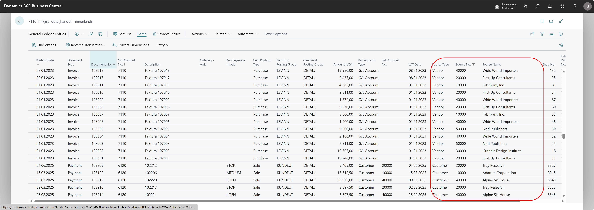

# General lLedger Entries

It is added 3 new fields to the page for **General Ledger Entries**.
these fields shows the source of the created post.

- Source type like vendor or customer or other modules.
- Source No. - The number connected to the source type like vendor or customer number.
- Source Name - The name of the source.

