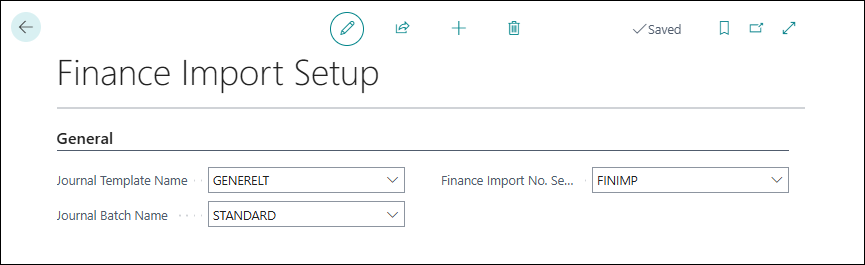

# Setup

The Finance Import Setup is found with search in tell me for **Finance Import Setup**.

This fields needs to be populated:

## General

**Journal Template Name** - name of the general ledger template to use for the imports.
**Journal Batch Name** - The name of the general ledger batch to  use for the imports.
**Finance Import No. Series** The name of the number series to be used as document numbers for the general ledger.
