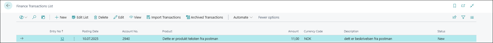
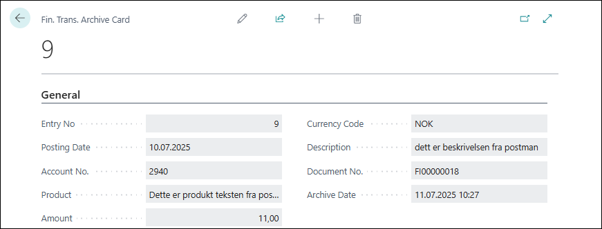

# Finance Transaction Import

To find the Finance Transactions who is imported search for **Finance Transactions List**

## Fields

Thi holdes the archive of the imported transactions. This page is not editable.

**Entry No.** - Auto incremented unique vale used as identification.
**Posting Date** - Date this record should be posted on.
**Account No** - A G/L account number. this is validated before it is imported to journal.
**Product** - The product information not totally sure how this will be treated.
**Amount*** - The amount on this transaction.
**Currency Code** - Currency of the transaction can use both blank and local currency.
**Description** - The description of the transaction - not sure how to handle yet.

## Menu

**View** - This open one record to show all information for one record in a card page.

