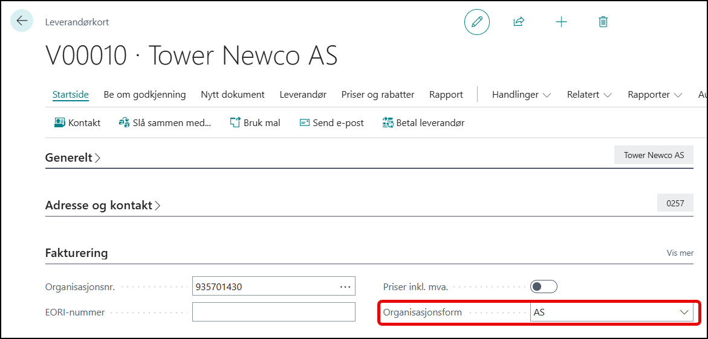
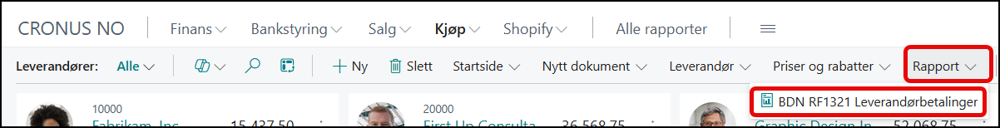
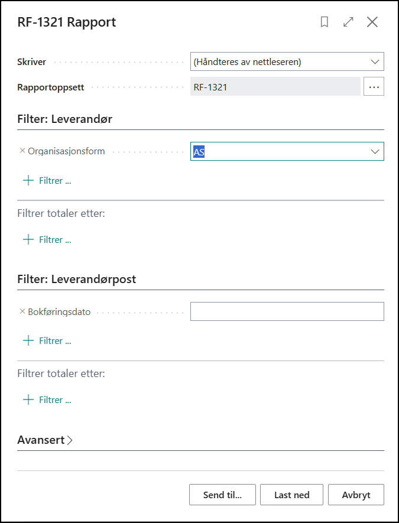
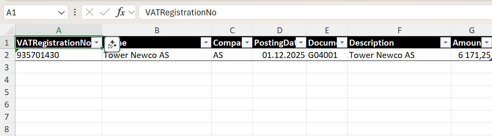

# RF1321 rapportering

I leverandørlisten er det mulig å ta ut en Excel rapport for RF1321 rapportering.

# Krav til utfylte felter
Feltet **Organisasjonsform** under fanen **Fakturering** må fylles ut.
(Den skal settes av integrasjonen.)

# Kjøre rapporten

du finner den i menyen under rapporter:

Og da kommer den opp med disse filtermulighetene:

Når du trykker **Last ned** så vil den laste ned et Excel ark som har denne layouten:

