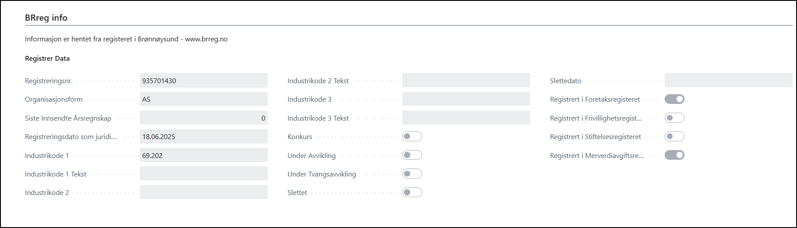
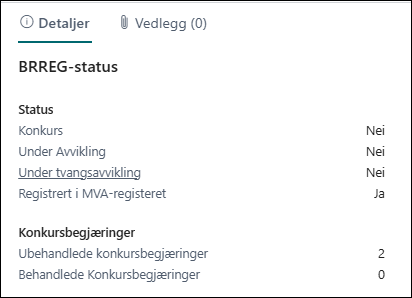
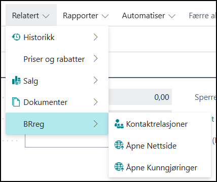
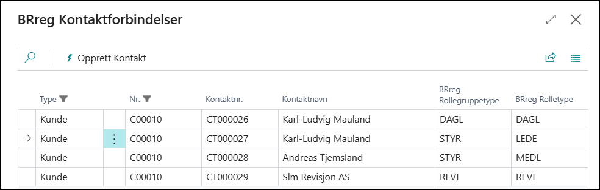
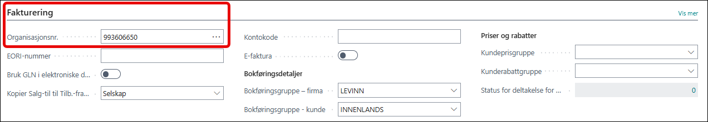
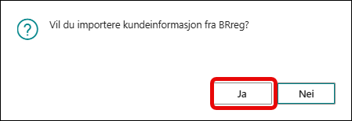
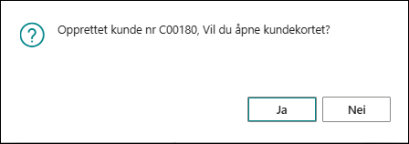

# Kundekortet

På kundekortet er det 3 større endringer. Samme som for leverandør.
Det er lagt til et menypunkt og en ekstra fane og en faktaboks.

## Ny fane BRreg Info

Her er det hentet ut en del data fra Brønnøysundregisteret.  Dette er bare opplysningsfelter og kan ikke redigeres. Her finner du lett tilgang til hvilke registre enheten er koblet mot og kritiske data som for eksempel avvikling eller konkurs.

## Ny faktaboks BRreg Status

Her finner du nøkkelinformasjon om enheten. Bla om den er konkurs og registrert i MVA registeret.

## Nytt menypunkt BRreg

Under dette menypunktet finner du 4 nye menypunkter.

- Kontaktrelasjoner
- Åpne nettsiden
- Åpne Kunngjøringer

### Kontaktrelasjoner

Ved åpningen av menypunktet kommer denne siden opp:

Her på siden for roller kan du gå videre til de kontakter som er knyttet til denne enheten.

### Åpne nettsiden

Dette menypunktet er en link som tar deg til brønnøysundregistrene på brreg.no.

Menypunktet åpner siden for organisasjonsnummeret på kundekortet.

### Åpne Kunngjøringer

Dette menypunktet er en link som tar deg til brønnøysundregistrene på brreg.no.

Menypunktet åpner siden med kunngjøringer for  organisasjonsnummeret på kundekortet.

## Opprette Kunde fra kundekortet

Under fanen **Fakturering** i feltet **Organisasjonsnummer**
Legg inn den nye kundens organisasjonsnummer og trykk **Enter**.
Du vil få en melding om du ønsker å importere data fra BRREG.

Etter **ja** vil du få en melding om at kunden er opprettet og du har fått alle relevante data fra BRREG.

Du får spørsmål om du ønsker å åpne kundekortet trykk **ja** hvis du ønsker det.

## Validering av organisasjonsnummeret

Hvis man trykker på de tre prikkene på feltet organisasjonsnr. så kan man validere organisasjonsnummeret mot
BRreg.no og det sjekkes:

- Organisajsonsnummer
- Adresse
- Postnummer
- Poststed
- Landkode

Les mer her: [Validering organisasjonsnummer](brreg-page-validate-orgno.md)