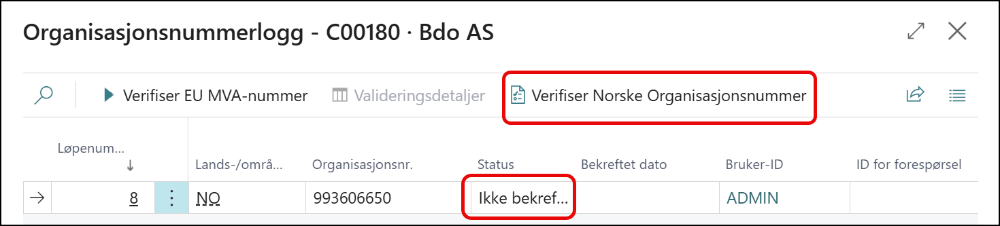
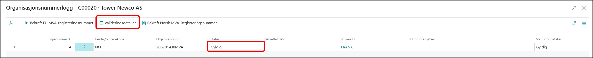
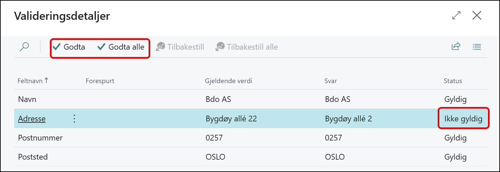

# Validering av organisasjonsnummer

Når man står på organisasjonsnummeret og trykker på de tre prikkene kommer man til validering av organisasjonsnummer.

Organisasjonsnummeret er ikke gyldig og vi kan sjekke dette med knappen **Bekreft Norske Organisasjonsnummer**
hvis organisasjonsnummeret finnes i BRreg.no så vil den sette feltet status til gyldig.

hvis vi vil sjekke grunnleggende informasjon som

- Navn
- Adresse
- Postnummer
- Poststed
- Landkode

så kan vi trykke på knappen på **valideringsdetaljer**.

Der inne kan vi sjekke om adresseinformasjonen er korrekt og hvis det er uoverensstemmelser kan vi trykke godta og data vil bli oppdatert med gjeldene informasjon.
