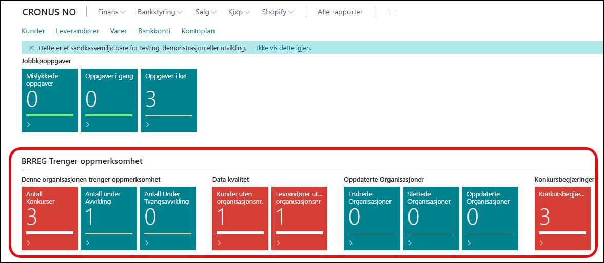
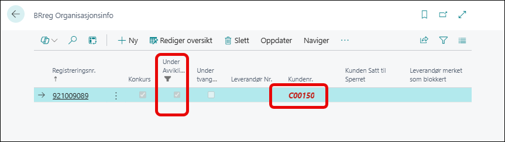
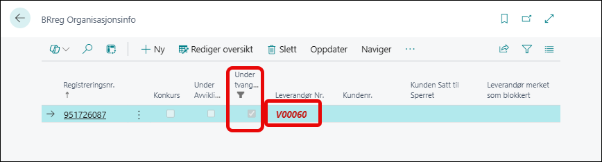
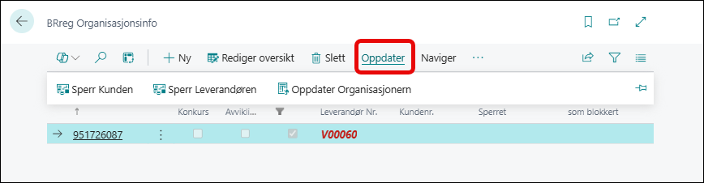
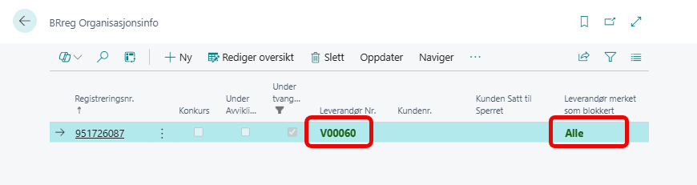
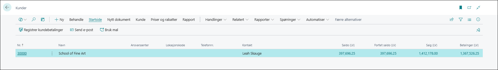

# Fliser på rollesenteret

På rollesenteret for Forretningsleder er det lagt til 9 fliser i gruppen
 **BRREG Trenger oppmerksomhet** slik at det skal være enkelt å følge med på status av kunder og leverandører.

Disse flisene kan man klikke på og kommer da inn på disse sidene:

## Informasjon i sidene

### Antall under avvikling

Her ser vi en leverandør som er under avvikling og feltet kundenr. Sperret er blank. kunden er da ikke sperret og vises derfor i rødt.

### Antall under tvangsavvikling

Her ser vi en Leverandør som er Under tvangsavvikling. Feltet Kunde sperret er ikke satt til blokkert og da vises kunden i rødt.

#### Sette kunder og leverandører til sperret

Inne på sidene med kunder og leverandører med en status som trenger tilsyn har vi mulighet til å blokkere kunden eller leverandøren fra menypunktet Handlinger og **Sperr Kunden** og menypunktet **Sperr leverandøren**.

Menypunktet vil sperre Leverandøren i dette tilfellet og sette den til grønn.

Her ser vi at denne er nå sperret og vi vil da ikke betale til denne leverandøren.

### Data Kvalitet

Under datakvalitet har vi samlet kunder og leverandører som mangler organisasjonsnummer. Klikker du her så åpner listen med kunder eller leverandører seg med filter på de som ikke har organisasjonsnummer og slik kan vi enkelt redigere disse og legge inn manglende informasjon.

### Oppdaterte organisasjoner

De tre neste flisene er en liste med organisasjoner hvor det har skjedd en endring i registeret i Brønnøysund.

de som registreres her er de som er **Endrede** , **Slettede** og **Oppdaterte** organisasjoner.

Endringer kan være endringer i adresse, kontaktinformasjon  eller annen info om organisasjonen. 

Oppdaterte er roller som er oppdatert for organisasjonen.

Slettede er organisasjoner som er slettede i Brønnøysundregisteret. Disse organisasjonene er ikke lenger tilgjengelig. og bør sperres i systemet.
