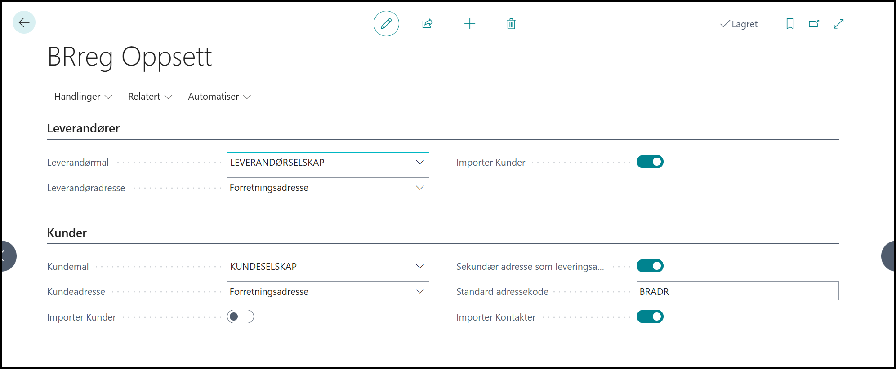
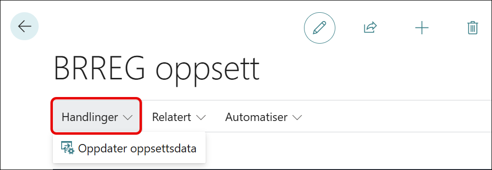
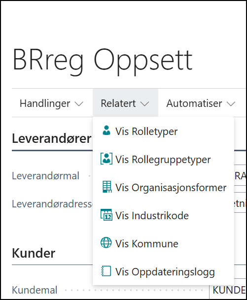
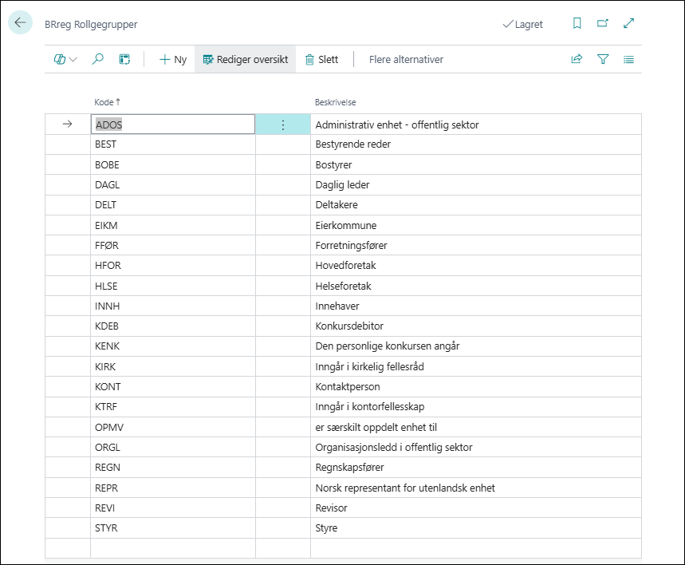
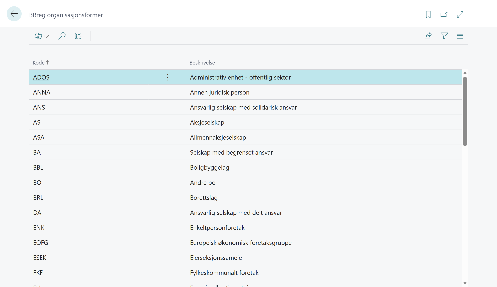
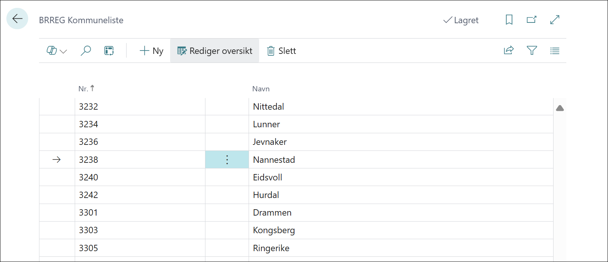
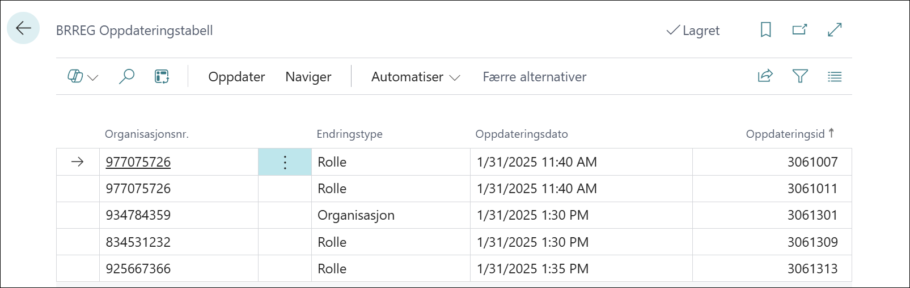

# BRREG Oppsett

## Leverandører

---
I feltet **Leverandør mal** velges den malen som skal benyttes ved import fra BRREG.

I feltet **Adresse for Leverandører** er valget enten *Forretningsadresse* eller *Postadresse*. Valgt adressetype blir adressen som blir hentet inn på leverandørkortet.

I feltet **Tillat import av Leverandører** angir du om det skal være tillatt å importere leverandører fra BRREG og inn i Business Central. Standard er at det er lov. 

## Kunder

---
I feltet **Kunde mal** velges den malen som skal benyttes ved import fra BRREG.

I feltet **Adresse for kunder** er valget enten *Forretningsadresse* eller *Postadresse*. Valg adresse blir adressen som blir hentet inn på leverandørkortet.

I feltet **Tillat import av Kunder** angir du om det skal være tillatt å importere leverandører fra BRREG og inn i Business Central. Standard er at det er lov.

I feltet **Sekundær adresse som leveringsadresse** angir vi om sekundære adresser blir lagt til i adresseregisteret for kunden.

I feltet **Standard Adressekode** angir vi koden som skal benyttes i adresseregisteret for adresser fra BRREG.

## Menypunkt Handlinger

Under menypunktet handlinger finner vi dette menypunktet:

### Menypunkt Oppdater Oppsettsdata
Dette menypunktet frisker opp oppsettsdata for underliggende tabeller hvis behov for det.

## Menypunkt Relatert

Under menypunktet Relatert finner vi disse menypunktene:

### Menypunkt Hent oppdateringer ENHETER

I dette menypunktet hentes oppdateringer for enheter fra Brønnøysund.
Hvis det er endringer, vil disse legge seg i endringsloggen.

### Menypunktet Hent oppdatering ROLLER

I dette menypunktet blir det hentet oppdatering for roller. Disse vil bli sjekket mot de enheter de tilhører. Endring og varsler blir lagt til i endringsloggen.

## Menypunktet Relatert

---
Under menypunktet Relatert finner vi disse menypunktene:

Her finner vi tabellene for de underliggende data til integrasjonen.

### Menypunktet Vis Rolletyper

Her vises de forskjellige rollene som kan være i datasettene fra BRREG.
Her et utsnitt fra tabellen:

### Menypunktet Vis Rollegruppetyper

Her vises de forskjellige rollegruppene som kan være i datasettene fra BRREG.
En rolle kan tilhøre en rollegruppe.
Her et utsnitt fra tabellen:

### Menypunktet Vis selskapstypene

Her vises de forskjellige selskapstypene  som kan være i datasettene fra BRREG.
Her et utsnitt fra tabellen:

### Menypunktet Vis næringskoder

Her vises de forskjellige næringskodene som kan være i datasettene fra BRREG.
Disse kodene blir vedlikeholdt av Statistisk Sentralbyrå.
Her et utsnitt fra tabellen:

### Menypunktet Vis kommuner

Her vises de kommunene som kan være i datasettene fra BRREG.
Datasettet vedlikeholdes av Kartverket.
Her et utsnitt fra tabellen:

### Menypunktet Vis Oppdateringsloggen

Her vil alle endringer blir lagt her og her blir endringene utført fra.
Det er foreløpig ingen automatikk på endringene. Et ønske om kontroll før noe slettes eller endres.
Her et utsnitt fra tabellen:

