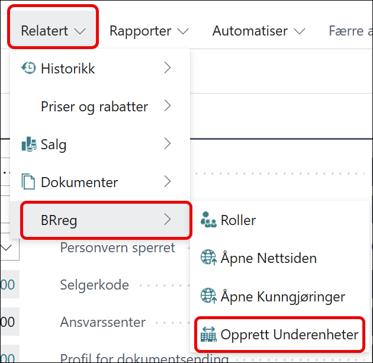
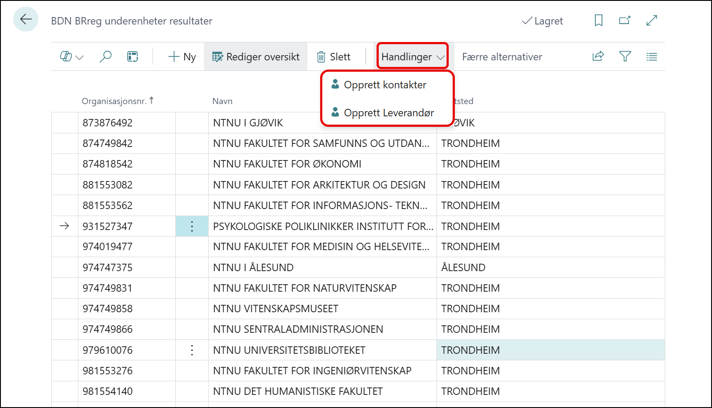

# Underenheter

Underenheter finner du i BRreg menyen på kunder og leverandører som dette:

Når du da klikker deg inn på **opprett underenheter** vil denne siden komme opp.

Denne listen inneholder alle underenheter til dette organisasjonsnummeret.

Ønsker du å opprette underenheten som en leverandør eller kunde så kan dette gjøres fra menyen under handlinger.
Kunden og leverandøren blir opprettet og fakturakonto blir satt til hovedenhetens nummer, slik at alle faktura blir sendt til hovedenheten.